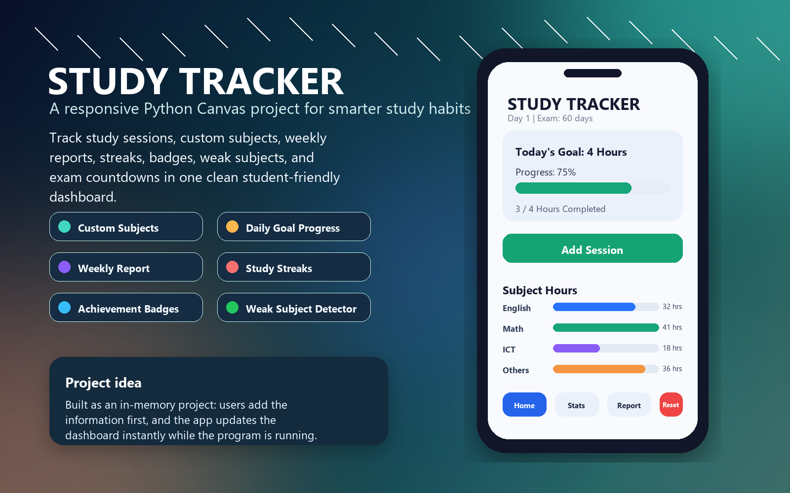
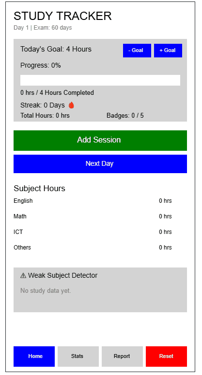

# Study Tracker

I built a Study Tracker project using Python Canvas for Stanford's Code in Place 2026 Final Project.

The idea is simple: students should be able to enter their own study sessions and instantly understand their progress. Since this is a project app, I made it with in-memory data while the program is running, so it focuses on the logic, interface, and user experience instead of database storage.

Check it on Code in Place IDE Live :- https://codeinplace.stanford.edu/cip6/share/Vw17G8blJbx0oFzDYm4b

Key features:
- Responsive, user-friendly dashboard
- Add sessions by subject, hours, and minutes
- Add (By typing subject's name in the console) and delete subjects
- Daily goal progress with completion feedback
- Subject-wise statistics with bar charts
- Weak subject detector to show neglected subjects
- Weekly report with most and least studied subjects
- Study streak and longest streak tracking
- Achievement badges for milestones
- Exam countdown and reset option

The app does not just store numbers, it analyzes them and gives the learner a clearer picture of study habits.

This project can be best for practicing:
- Python functions and lists/dictionaries
- Event handling with buttons
- Data analysis logic
- UI layout thinking
- Building a project from a real student problem
